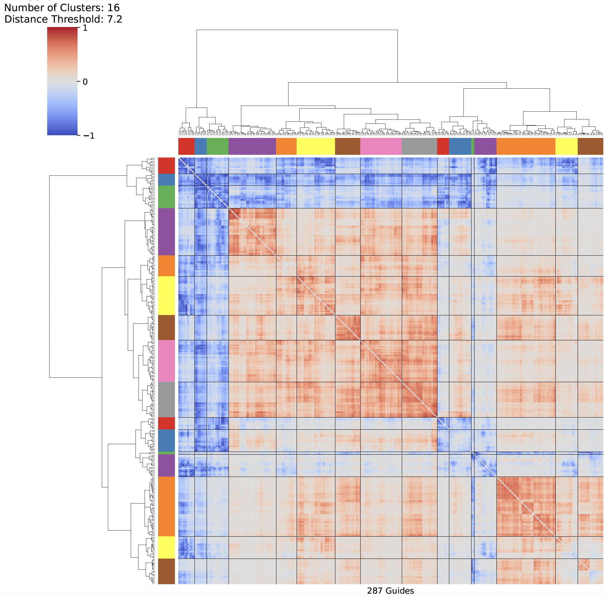
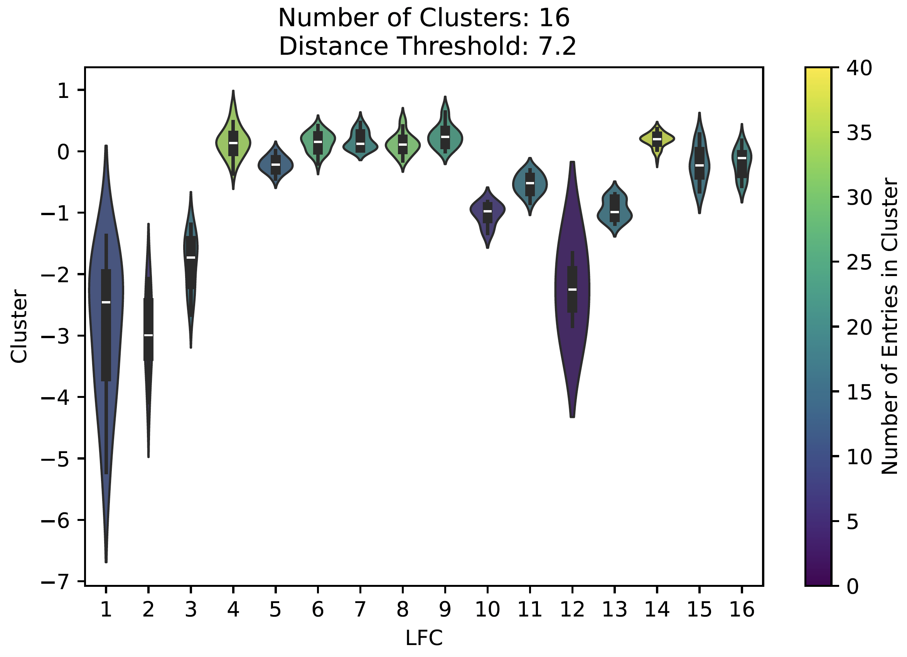

# PWES-BE

Implementation of PWES, Proximity Weighted Enrichment Score,[Ngan *et al* 2023](https://doi.org/10.7554/eLife.80640), reversed engineered and adapted to run on more than one chain in a structure, and additional statistics.


The Proximity Weighted Enrichment Score is used to map CRISPR base editing guide log-fold changes to a structure, and cluster guides based on pairwise inter-residue distance and sum of scores.

### Dependencies
- pymol-open-source
- Python 3
- Numpy
- Pandas
- Scipy
- Biopython
- Matplotlib
- Scikit-learn

### Installation

This package has the option to utilize pymol or pymol-open-soruce. This is optional, but allows clusters to be automatically mapped to a structure, stored as a pymol session (conda install conda-forge::pymol-open-source)

Can be installed using:
```
conda install conda-forge::pymol-open-source
```

The package can be installed either using git, or directly using pip

Newest vesion:

```
git clone https://github.com/biodrengen1998/PWES-BE
cd PWES-BE
pip install .
```

PyPi installation

```
pip install pwes
```


